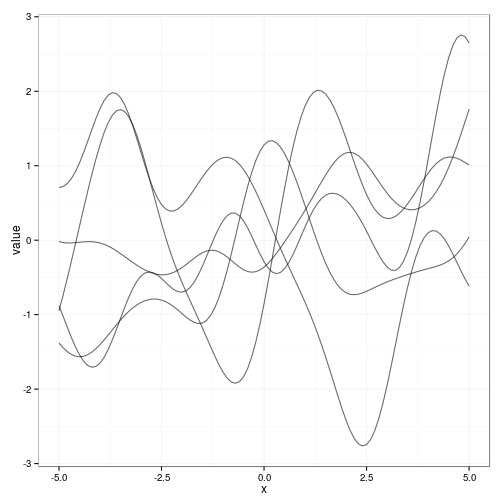
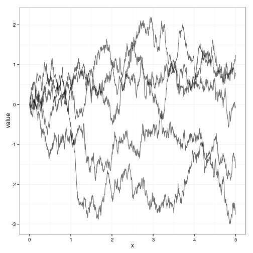
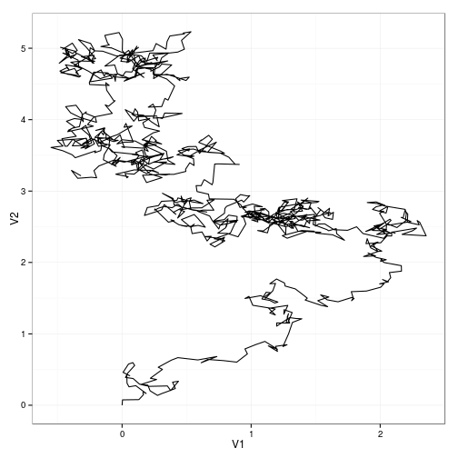

## Definitions

_Gaussian process_ is a stochastic process where any finite number of
random variables have a joint Gaussian distribution.

A Gaussian process is completely specified by its _mean function_
$m(x)$ and _covariance function_\(k(x,x')\). They are defined by

\[m(x) = \mathcal{E}[f(x)],\]

\[ k(x,x') = E\big[\big(f(x) − m(x))(f(x') − m(x')\big)\big],\]

and will write the Gaussian process as \( f(x) \sim GP(m(x), k(x,
x'))\).

--- .class #id 

## Squared exponential

\[ cov(f(x_p), f (x_q)) = k(x_p , x_q) =
    \exp\Big(−\frac{1}{2} |x_p − x_q |\Big)^2.\]

 

---

## Brownian Motion

\[ cov(f(x_p), f (x_q)) = k(x_p , x_q) = \min(x_p, x_q).\]

  

---

## Predictions

\[\overline{y}^* = K^*(\lambda^2\cdot I+K)^{-1}\cdot y \]

\[C = K^{**}-K^*\cdot(\lambda^2\cdot I+K)^{-1}\cdot(K^*)^t \]

 
